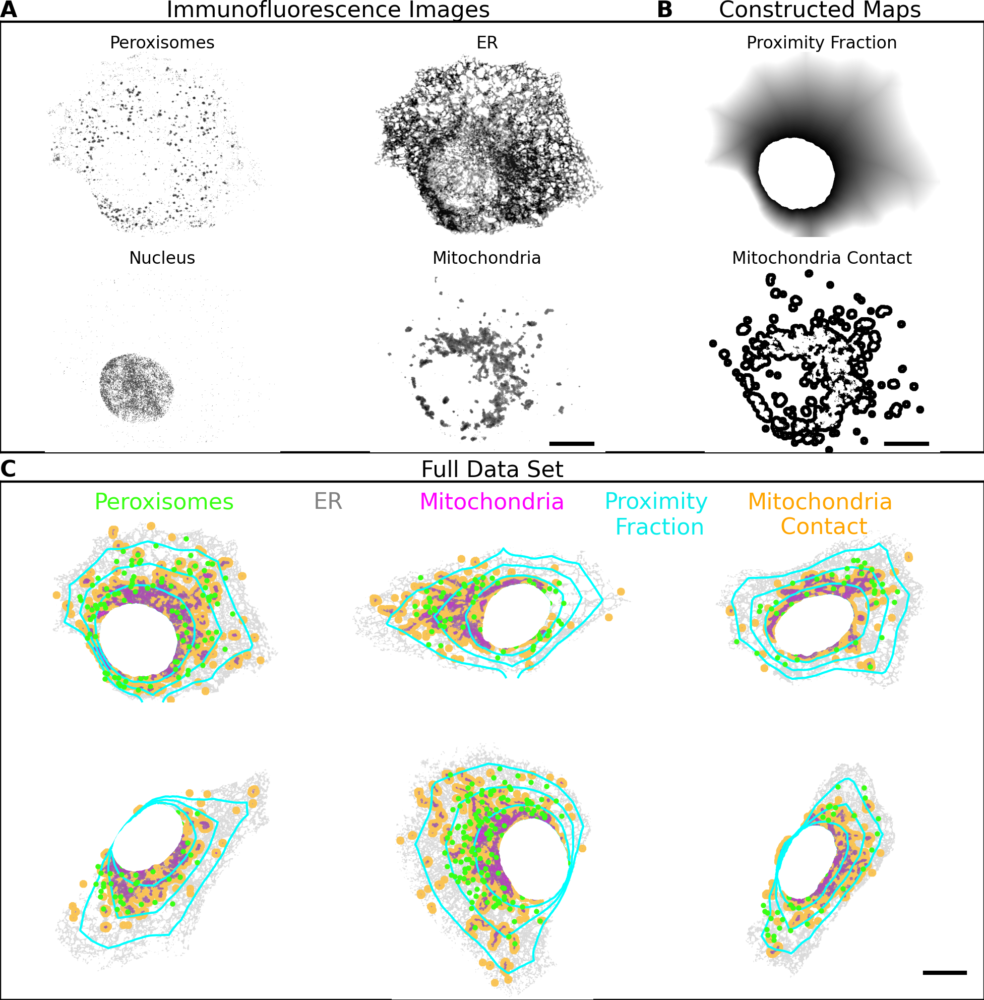
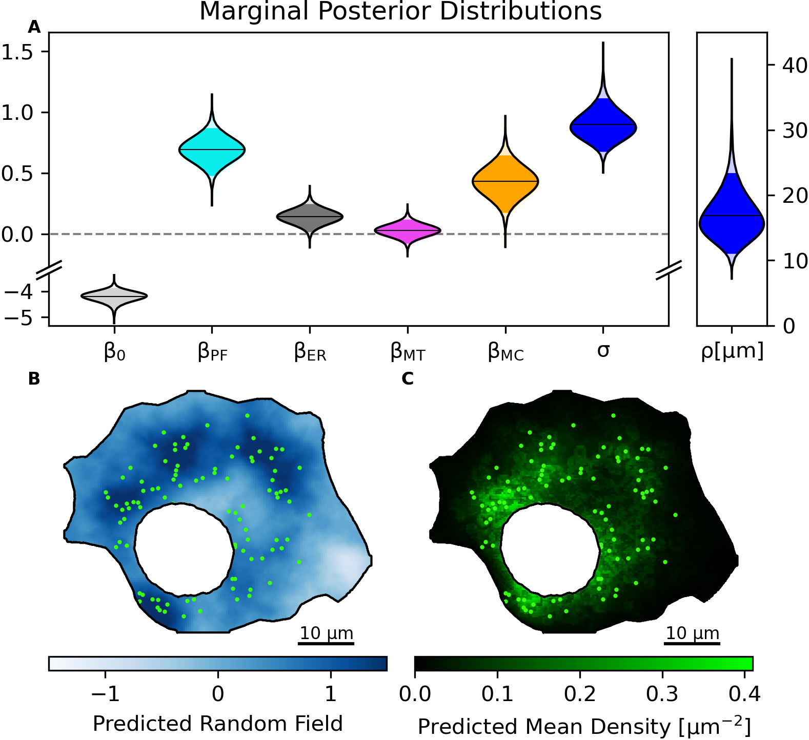

# Spatial Phenotypes of Puncta

## Introduction

Spatial Phenotypes of Puncta is a project dedicated to quantifying the spatial distribution of puncta within cells using advanced statistical modeling techniques. By fitting a Log-Gaussian Cox Process (LGCP) to point patterns, this repository aims to uncover the hidden heterogeneity in puncta structures, providing valuable insights into cellular biology. This work supplements our upcoming manuscript, which explores the application of LGCP for modeling spatial phenotypes in cell biology. Recognizing that the interpretation and fitting of LGCP models can be complex, this repository offers a step-by-step analysis to serve as a comprehensive reference for researchers interested in applying these models to their own data.

Here we provide two examples, of applying these statistical models. 
- Synthetic data: Applying the model to synthetic data generated by a simulation of diffusing particles in a crowded cell.
- Experimental Images of Peroxisomes and other components: Quantifying the spatial association of peroxisomes with the ER, mitochondria, proximity to the nucleus, and hidden factors captured with a Gaussian random field component.

## Project Structure

- **`data/raw/`**: Contains the raw experimental images used for analysis.
- **`data/processed/`**: Stores processed data outputs from the preprocessing notebook.
- **`data/output/`**: Stores the results from the inference of the model.
- **`data/synthetic_data//`**: Stores the synthetic data generated by the simulations
- **`notebooks/`**:
  - **`preprocessing.ipynb`**: Jupyter notebook for data preprocessing of the experimental images.
  - **`analysis_inlabru.Rmd`**: R Markdown notebook for model fitting with the inlabru package for the experimental data.
  - **`simulation.py`**: code for the simulation objects
  - **`simulation_synthetic_dataset.ipynb`**: Notebook for running the simulations and preparing the synthetic data.
  - **`analysis_inlabru_synthetic_data.Rmd`**: R Markdown notebook for model fitting with the inlabru package for the synthetic data.
  - **`make_figures.ipynb`**: Jupyter notebook, to make nice figures of the data and infernence results
- **`docs/`**: includes html files of the notebooks which are more convinient to read the steps of the analysis
- **`figures/`**: some figures of the dataset and the results of the analysis

## Prerequisites

To run the notebooks as they are you will need:

- **Python** with Jupyter Notebook for preprocessing.
  - the packages: PIL, geopandas, shapely, rasterio, numpy, scipy, cv2, skimage, matplotlib.pyplot, and itertools

the preprocessing and can be done also differently and with other packages, it is imortant however that the output from the preprocessign is readable/compatible with the packages in R in which we do the statistical analysis

- **R** with RStudio for model fitting.
  - the packages: INLA, inlabru, sf, fmesher, ggplot2, terra

## Spatial Phenotypes of simulated Diffusing Particles in a crowded Cell 

We first simulate diffusing particles in a cell, represented by an annulus, where the inner circle represents the nucleus and the outer circle the cell membrane. In these cellular regions, we randomly place static crowders, causing particles to reflect upon crossing them. Additionally, we incorporate population dynamics by generating and spontaneously degrading particles. Particle generation occurs at random locations on the nucleus surface, ensuring that these locations are not covered by a crowder.

The system is simulated until it reaches stationarity, after which a snapshot of the particle locations is taken for further analysis. We then **hide** the crowders from the dataset and aim to capture the heterogeneity they induce using our statistical model. In the model, we include the distance from the nucleus as a predictive map.

  

For our full dataset we take 9 snapshots each from a different realization of cellular enviroment (different crowder configurations)

## Spatial Phenotypes of peroxisomes

Our LGCP model quantifies the following spatial phenotypes of peroxisomes:

- **Perinuclear Localization**: Likelihood of peroxisomes being found in the perinuclear region.
- **Proximity to Mitochondria**: Likelihood of peroxisomes being within 1 micrometer of mitochondria.
- **Overlap with ER**: Likelihood of peroxisomes overlapping with the ER.
- **Hidden Structured Effects**: Detection of underlying spatial structures affecting peroxisome distribution.

## Running the Analysis

The main files to run the analsysis are preprocessing.ipynb and analysis_inlabru.Rmd. 

  1. Preprocessing:
    In this notebook we pinpoint the locations of peroxisomes from the fluoresence image, and we construct the predictive maps that depends on images of the nucleus, the ER and mitochondria. Last we stitch together the data from all the cells in a single spatial frame and we export them in a format compatible with the analysis that follows.
  2. Model Fitting:
    We fit a log gaussian cox process model through the inlabru package using the output of the preprocessing step. The steps of fitting invovle making a mesh of the spatial domain, constructing the model (how the mean density depends on the components) and finaly fitting with inlabru.

## Dataset

At pannel A you can see fluoresence images of some of the channels, at pannel B the constructed maps used for the model and at pannel C is the dataset used in the model

## Results

Pannel A we present the marginal posterior distributions of the parameters of the model, and at pannels B and C gaussian random field and mena density that the model predicts.

